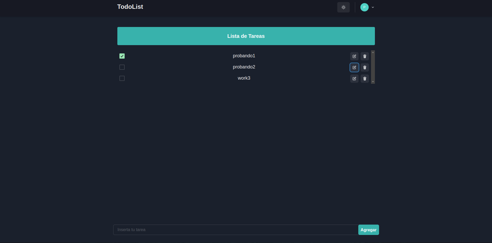

# TODOLIST REACT

## Live Site

[TodoList-React](https://todolist-react-levelup.netlify.app/)

## Install Dependencies

npm install

## Run the project on your localhost

npm run dev

## Project Preview

 

